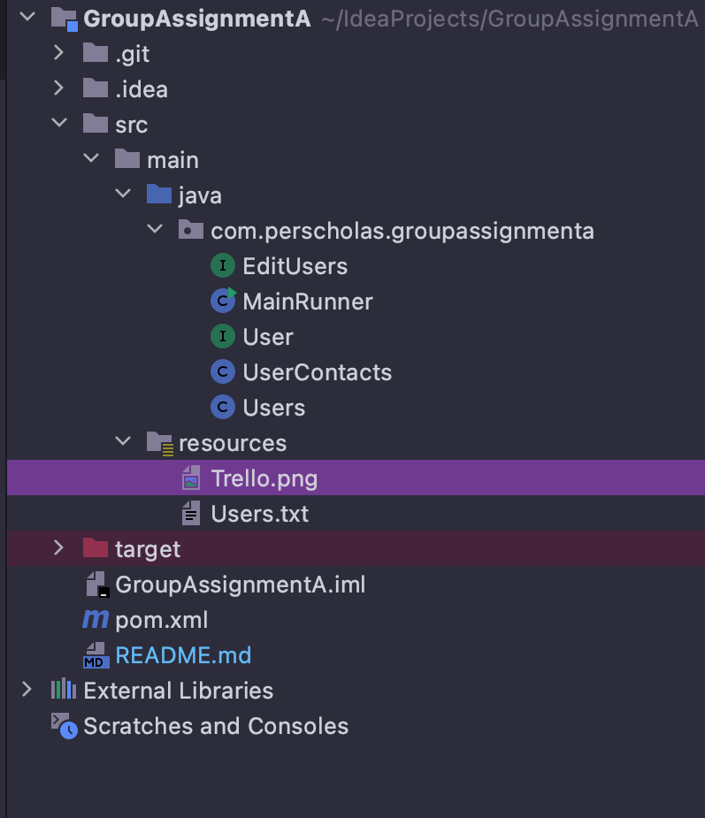

# Group Assignment

## Group B

### Team members: **Timothy, Veronika, Konstantin**

### Project Summary:
* A Java console application that manages an address book where the contacts are saved.

### User Stories:

* As a user, I want to print all available contacts, so that I can view all contacts in a CSV like view ordered ascending by name then surname
* As a user, I want to add new contact, so that I can increase my contacts list
* As a user, I want to search contacts based on name, so that I can find the appropriate contacts in a short time.
* As a user, I want to search contacts based on phone numbers, so that I can find the appropriate contacts in a short time.
* As a user, I want to edit contact based on name, so that I can modify contact information and have updated information.
* As a user, I want to edit contacts based on phone numbers,so that I can modify contact information and have updated information.
* As a user, I want to delete contact based on name, so i keep my contact list clean.
* As a user, I want to delete contacts based on phone numbers, so i keep my contact list clean.

### Instructions and Assumptions:

* Git and GitHub repo with all members of the group 
####  -Timothy: https://github.com/timgwilt
####  -Veronika: https://github.com/paramovv
####  -Konstantin: https://github.com/Snajjper1
  
* A Trello board with the user stories and all members of the group included
  
* Maven project
  
* An AddressBook class, MainRunner class, interfaces, use abstraction if you can!
* Some fields are optional like (phone, address)
* Use Interfaces and Methods available or create your own if they don’t exist e.g. (comparable, comparator)
* Break the user stories to smaller tasks 
* The Clients are Jafer and Leah.

### Project Concepts:
* Use comments to make the code understandable.
* Utilize OOP concepts. 
* Use Exception Handling.
* Use Collections or Arrays  .
* Use BufferedReader/Writer.
* Commit and push to GitHub. ( Minimum of 10 commits).
